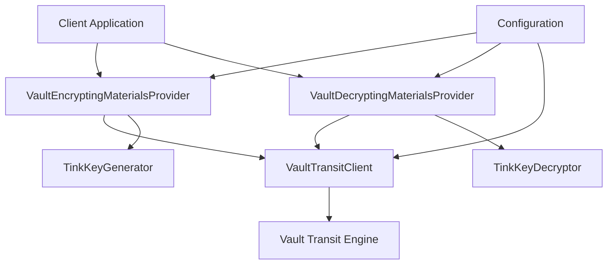

# Design Document

## Overview

The Vault Crypto Provider implements a secure, GDPR-compliant encryption key management system using HashiCorp Vault's transit encryption engine. The design follows a two-tier key hierarchy where Vault manages Key Encryption Keys (KEKs) per subject, and these KEKs encrypt Data Encryption Keys (DEKs) that are used for actual data encryption.

This approach ensures that:
- Each subject has cryptographically isolated encryption materials
- GDPR right-to-be-forgotten can be implemented by deleting subject-specific keys in Vault
- The system leverages Vault's enterprise-grade security features
- Performance is optimized through asynchronous operations and connection pooling

## Architecture

### Key Management Hierarchy

```
Subject Data → DEK (Tink AEAD) → Encrypted with KEK → KEK managed by Vault Transit Engine
```

1. **Data Encryption Key (DEK)**: Generated using Tink's AEAD primitive for each encryption operation
2. **Key Encryption Key (KEK)**: Subject-specific key managed by Vault's transit encryption engine
3. **Master Key**: Managed internally by Vault's transit engine (transparent to our provider)

### Component Architecture



## Components and Interfaces

### VaultEncryptingMaterialsProvider

Implements `EncryptingMaterialsProvider` interface.

**Responsibilities:**
- Generate new DEKs using Tink's AEAD primitive
- Encrypt DEKs using Vault's transit encryption with subject-specific keys
- Return EncryptionMaterial with plaintext DEK, encrypted DEK, and context

**Key Methods:**
```java
public CompletableFuture<EncryptionMaterial> encryptionKeysFor(String subjectId)
```

### VaultDecryptingMaterialsProvider

Implements `DecryptingMaterialsProvider` interface.

**Responsibilities:**
- Decrypt encrypted DEKs using Vault's transit encryption
- Reconstruct Tink AEAD primitives from decrypted DEK material
- Handle subject-specific key isolation

**Key Methods:**
```java
public CompletableFuture<Aead> decryptionKeysFor(String subjectId, byte[] encryptedDataKey, String encryptionContext)
```

### VaultTransitClient

Handles all Vault API interactions.

**Responsibilities:**
- Manage Vault authentication and connection lifecycle
- Perform encrypt/decrypt operations via Vault's transit API
- Handle connection pooling and retry logic
- Manage subject-specific key naming and isolation

**Key Methods:**
```java
CompletableFuture<byte[]> encrypt(String keyName, byte[] plaintext, String context)
CompletableFuture<byte[]> decrypt(String keyName, byte[] ciphertext, String context)
CompletableFuture<Void> ensureKeyExists(String keyName)
```

### VaultCryptoConfiguration

Configuration class for Vault connection and behavior.

**Properties:**
- `vaultUrl`: Vault server URL
- `vaultToken`: Authentication token
- `transitEnginePath`: Path to transit engine (default: "transit")
- `keyPrefix`: Prefix for subject-specific keys (default: "pi2schema")
- `connectionTimeout`: HTTP connection timeout
- `requestTimeout`: Request timeout
- `maxRetries`: Maximum retry attempts
- `retryBackoffMs`: Base retry backoff in milliseconds

## Data Models

### Subject Key Naming Strategy

Keys in Vault will follow the pattern: `{keyPrefix}/subject/{subjectId}`

Example: `pi2schema/subject/user-12345`

This ensures:
- Clear subject isolation
- Easy identification for GDPR deletion
- Namespace separation from other Vault usage

### Encryption Context Format

The encryption context will include:
- Subject ID
- Timestamp of key generation
- Provider version for future compatibility

Format: `subjectId={subjectId};timestamp={timestamp};version={version}`

### Error Handling

#### Custom Exceptions

```java
public class VaultCryptoException extends RuntimeException
public class VaultAuthenticationException extends VaultCryptoException
public class VaultConnectivityException extends VaultCryptoException
public class SubjectKeyNotFoundException extends VaultCryptoException
public class InvalidEncryptionContextException extends VaultCryptoException
```

#### Error Scenarios

1. **Vault Unavailable**: Retry with exponential backoff, fail after max retries
2. **Authentication Failure**: Fail fast with clear error message
3. **Key Not Found**: For decryption, throw SubjectKeyNotFoundException
4. **Invalid Context**: Validate context format and throw appropriate exception
5. **Network Timeouts**: Retry with backoff, respect timeout configurations

#### Retry Strategy

- Initial retry delay: 100ms
- Maximum retry delay: 5000ms
- Exponential backoff multiplier: 2.0
- Maximum retries: 3
- Jitter: ±25% to prevent thundering herd

## Testing Strategy

### Unit Tests

1. **VaultEncryptingMaterialsProviderTest**
   - Test successful encryption material generation
   - Test Vault connectivity failures
   - Test invalid subject ID handling
   - Test concurrent request handling

2. **VaultDecryptingMaterialsProviderTest**
   - Test successful decryption
   - Test invalid encrypted DEK handling
   - Test subject key not found scenarios
   - Test encryption context validation

3. **VaultTransitClientTest**
   - Test Vault API interactions (mocked)
   - Test retry logic
   - Test authentication handling
   - Test connection lifecycle

### Integration Tests

1. **VaultCryptoProviderIntegrationTest**
   - Test full encrypt/decrypt cycle with real Vault instance
   - Test subject isolation (encrypt with one subject, fail to decrypt with another)
   - Test GDPR deletion scenario
   - Test performance under concurrent load

### Test Infrastructure

- Use Testcontainers for Vault integration tests
- Mock Vault API responses for unit tests
- Test with various Vault configurations (different auth methods, engine paths)
- Performance tests with concurrent operations

## Security Considerations

### Key Isolation

- Each subject gets a unique key in Vault's transit engine
- Subject IDs are validated to prevent path traversal attacks
- Encryption context includes subject ID to prevent key confusion attacks

### Authentication

- Support for Vault token authentication initially
- Token should be provided via secure configuration (environment variables, files)
- Future: Support for additional auth methods (AWS IAM, Kubernetes, etc.)

### Audit and Logging

- Log all Vault operations (without sensitive data)
- Include request IDs for correlation
- Log timing information for performance monitoring
- Ensure no plaintext keys or sensitive data appear in logs

### Network Security

- All communication with Vault over HTTPS
- Certificate validation enabled by default
- Support for custom CA certificates
- Connection timeouts to prevent resource exhaustion

## Performance Considerations

### Asynchronous Operations

All Vault operations return CompletableFuture to enable:
- Non-blocking I/O
- Concurrent request processing
- Better resource utilization
- Timeout handling

### Connection Management

- Java's built-in HttpClient with connection pooling for Vault API calls
- Keep-alive connections to reduce handshake overhead
- Configurable connection and request timeouts
- Proper connection cleanup on provider close

### Caching Strategy

Initial implementation will not include caching to ensure security, but future versions could consider:
- Short-term caching of Vault authentication tokens
- Connection pooling for performance
- Metrics collection for optimization

### Monitoring and Metrics

Expose metrics for:
- Vault operation latency
- Success/failure rates
- Active connection count
- Retry attempt counts